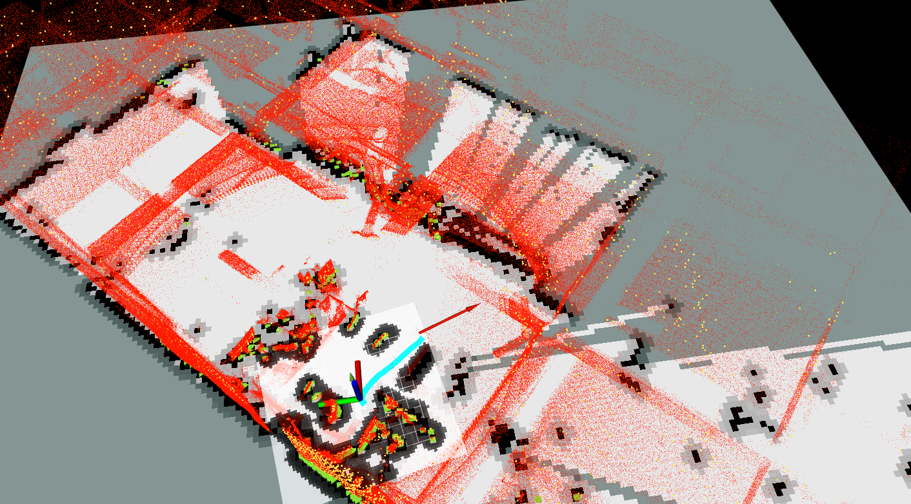
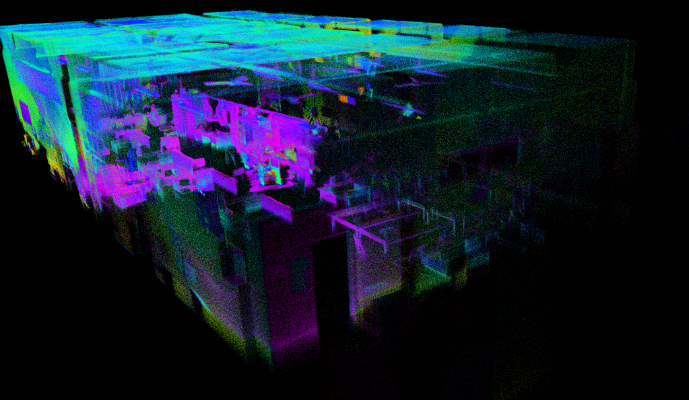
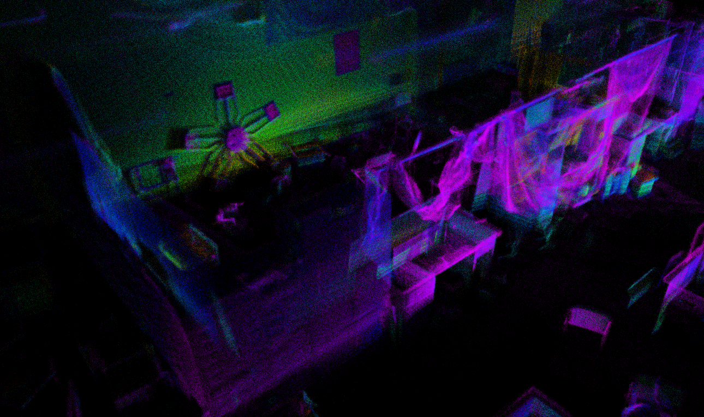
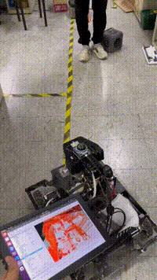
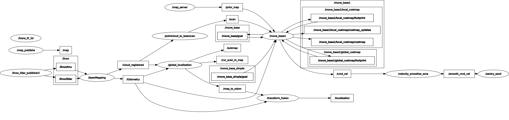
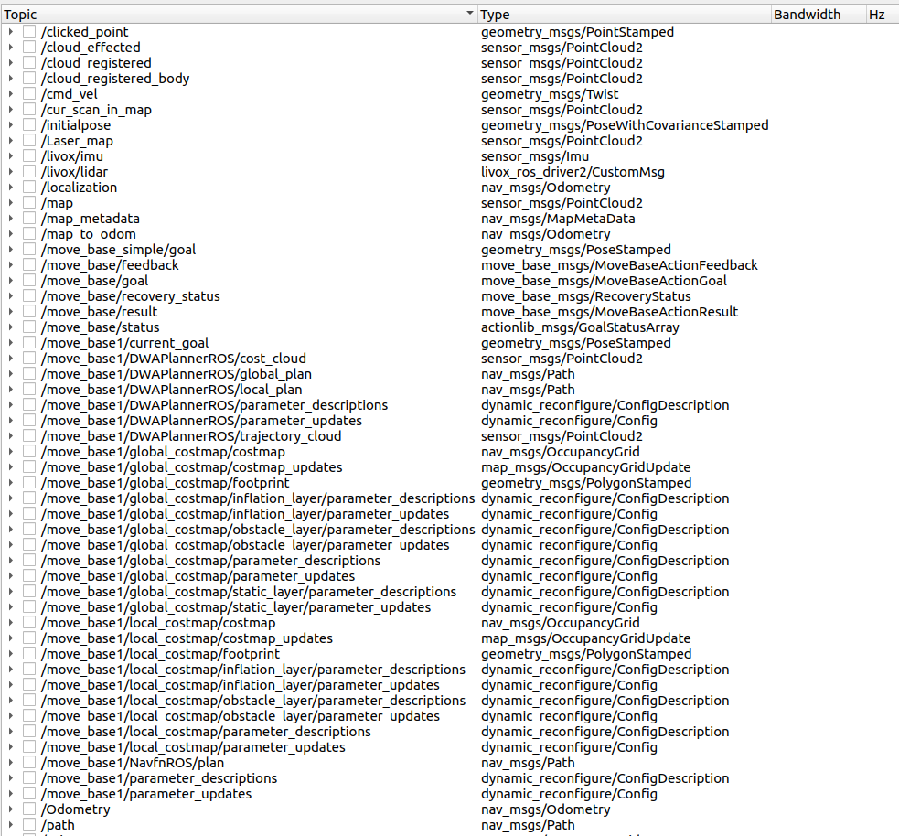
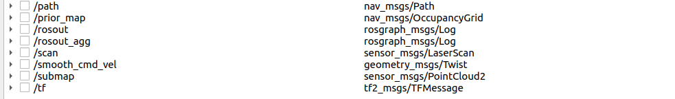
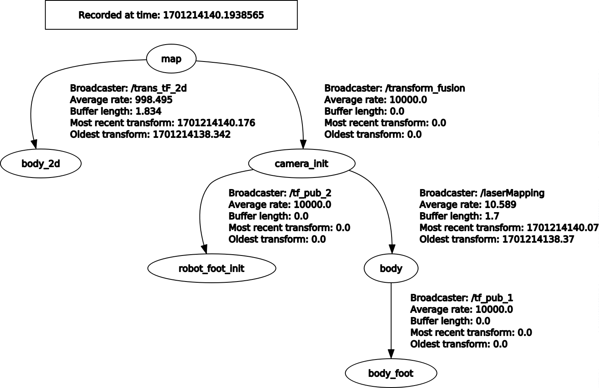
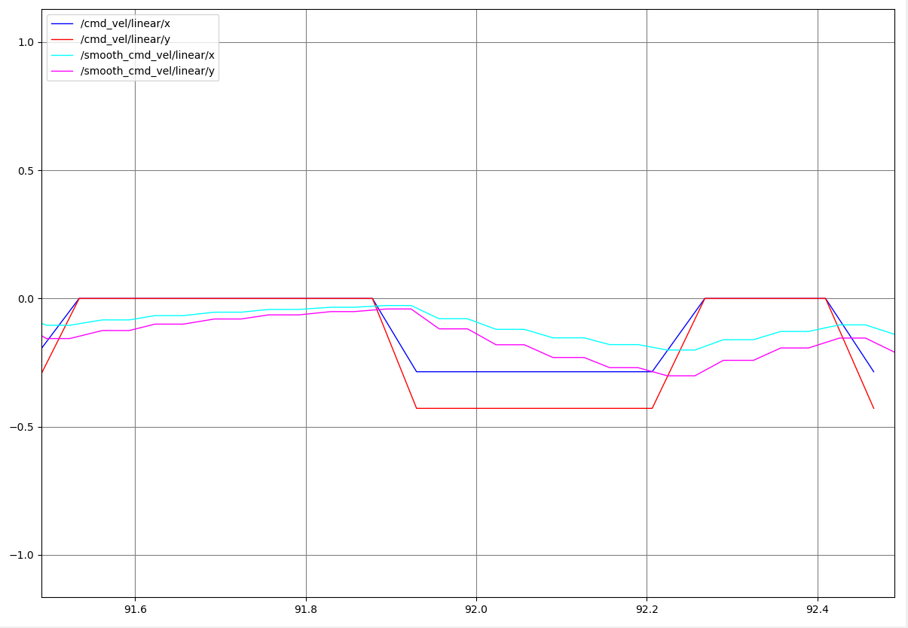

# The Navigation System for Omnidirectional Wheel Robot in the Real World

[](./README.md)
[](./README_CN.md)

## Introduction
This repository integrates various open-source algorithms to achieve 2-D localization and navigation on a wheeled robot platform.

Code repository: [https://github.com/66Lau/NEXTE_Sentry_Nav](https://github.com/66Lau/NEXTE_Sentry_Nav)

3-D navigation and exploration implementation: [https://github.com/66Lau/NEXTE_Sentry_Nav_3D](https://github.com/66Lau/NEXTE_Sentry_Nav_3D)

For a simulation environment: [https://github.com/66Lau/sentry_sim](https://github.com/66Lau/sentry_sim)

Environment:
- ROS Noetic
- Ubuntu 20.04  
- Lidar: Mid360

This repository contains various modifications and adaptations for different modules. It is recommended to clone this repository directly. Below is the development workflow and process of this repository:

<div align="center"></div>

## Hardware Info
- [MID360 Official Website](https://www.livoxtech.com/cn/mid-360)
- [Quick Start Guide for MID360](https://terra-1-g.djicdn.com/65c028cd298f4669a7f0e40e50ba1131/Mid360/Livox_Mid-360_Quick_Start_Guide_multi.pdf)
- [MID360 User Manual](https://terra-1-g.djicdn.com/65c028cd298f4669a7f0e40e50ba1131/Mid360/20230727/Livox_Mid-360_User_Manual_CHS.pdf)
- [Livox SDK2 Source Code](https://github.com/Livox-SDK/Livox-SDK2)
- [Livox ROS Driver 2 Source Code](https://github.com/Livox-SDK/livox_ros_driver2)

- [Livox ROS Driver 2 Installation Guide](https://blog.csdn.net/qq_29912325/article/details/130269367)
- [Virtual Machine and MID360 Bridging Guide](https://blog.csdn.net/sinat_39110395/article/details/123545816)

## Livox and Fast-Lio Configuration Process
1. Install [Livox SDK2](https://github.com/Livox-SDK/Livox-SDK2). The installation steps are detailed in the README. **Note:** Change the host IP to `192.168.1.50`. [How to modify Ubuntu IP](https://blog.csdn.net/sinat_39110395/article/details/123545816). The Lidar IP in this setup is `192.168.1.180`.
2. Install [Livox ROS Driver 2](https://github.com/Livox-SDK/livox_ros_driver2). Follow the steps in the README. **Note:** Before running, make sure to modify the host IP and Lidar IP in the configuration files.
3. Configure Fast-LIO:

References:  
- [FAST_LIO Repository](https://github.com/hku-mars/FAST_LIO)  
- [FAST-LIO Configuration Guide (Chinese)](https://blog.csdn.net/qq_42108414/article/details/131530293)  
- [Using MID360 with FAST-LIO2 on ROS1](https://blog.csdn.net/qq_52784762/article/details/132736322)  

```bash
sudo apt install libeigen3-dev
sudo apt install libpcl-dev
```

```bash
# Required for ROS2
sudo apt install ros-humble-pcl-ros
```

```bash
# Compile Fast-LIO
# Navigate to the 'src' directory of your workspace. Replace $A_ROS_DIR$ accordingly.
cd ~/$A_ROS_DIR$/src
git clone https://github.com/hku-mars/FAST_LIO.git
cd FAST_LIO
git submodule update --init
cd ../..
catkin_make
source devel/setup.bash
```

**Note:** If using MID360 (which requires `livox_ros_driver2` instead of `livox_ros_driver`), you need to modify `CMakeLists.txt` in the Fast-LIO repository to change `find_package(livox_ros_driver)` to `find_package(livox_ros_driver2)`. Also update `package.xml` and the corresponding `.cpp` files.

```bash
# Install Sophus
git clone https://github.com/strasdat/Sophus.git
cd Sophus
git checkout a621ff
mkdir build
cd build
cmake ../ -DUSE_BASIC_LOGGING=ON
make
sudo make install
```

If you encounter errors, refer to the [solution guide](https://blog.csdn.net/DerrickRose25/article/details/130173310).

Error example:
```bash
/home/lau/Sophus/sophus/so2.cpp:32:26: error: lvalue required as left operand of assignment
   unit_complex_.real() = 1.;
                          ^~
/home/lau/Sophus/sophus/so2.cpp:33:26: error: lvalue required as left operand of assignment
```

Modify `so2.cpp` at line 32:
```cpp
SO2::SO2()
{
  unit_complex_.real(1.);
  unit_complex_.imag(0.);
}
```

After successfully installing Sophus, recompile Fast-LIO.

Finally, run:
```bash
# Navigate to the workspace containing livox_ros_driver2
cd ~/$A_ROS_DIR$
source devel/setup.bash
roslaunch livox_ros_driver2 msg_MID360.launch
```

Open another terminal and run:
```bash
# Navigate to the workspace containing Fast-LIO
cd ~/$A_ROS_DIR$
source devel/setup.bash
roslaunch fast_lio mapping_mid360.launch
```

<div align="center"></div>
<div align="center"></div>
<div align="center">Fast-LIO Mapping Results, Automatically Saved in the PCD Directory</div>


## Navigation Process
### Introduction to Navigation:
- [ROS Navigation Basics](https://blog.csdn.net/Netceor/article/details/118997851)
- [Understanding ROS Robot Navigation](https://blog.csdn.net/qq_42406643/article/details/118754093)

---
### 1. Relocalization
After building the map, the robot can be localized using two methods:
- **Method 1:** Assume the initial position remains the same and use Fast-LIO’s odometry estimation for localization.
  - Drawbacks:
    1. The robot must start from the same initial position each time, otherwise, errors are introduced.
    2. Odometry drift accumulates over time.
- **Method 2:** Use the map for relocalization by matching the current Lidar point cloud with the prebuilt map. This method often requires manually setting the initial position estimate or utilizing additional robot sensors for rough initialization.

To avoid accumulated drift, **Method 2** is recommended: [FAST_LIO_LOCALIZATION](https://github.com/davidakhihiero/FAST_LIO_LOCALIZATION-ROS-NOETIC)

```bash
# Required packages, compatible with Python 3.8
sudo apt install ros-$ROS_DISTRO-ros-numpy
pip install numpy==1.21
pip install open3d
```

The original repository [FAST_LIO_LOCALIZATION](https://github.com/davidakhihiero/FAST_LIO_LOCALIZATION-ROS-NOETIC) was implemented in Python 2, but this repository replaces it with Python 3.

### Modifications to FAST_LIO_LOCALIZATION:
- `global_localization.py`
  - Change interpreter to `#!/usr/bin/python3`
  - Replace `import thread` with `import _thread` for Python 3 compatibility
  - Update Open3D API: `o3d.registration` → `o3d.pipelines.registration`
  - Modify `FOV = 6.28` on line 222 to match the actual Lidar range (for MID360: `2*pi` rad)
  - Update `FOV_FAR = 30` to match the actual max range of the Lidar

- `localization_MID360.launch`
  - Use `fastlio_mapping` with `mid360.launch` from Fast-LIO2
  - Adjust TF tree matching in line 28: `args="$(arg map) 5 _frame_id:=map cloud_pcd:=map" />`
  - Change `map` argument to the actual saved prior map path

Usage:
```bash
roslaunch livox_ros_driver2 msg_MID360.launch
roslaunch fast_lio_localization localization_MID360.launch 
# Publish initial pose (or use RViz to manually set it)
rosrun fast_lio_localization publish_initial_pose.py 0 0 0 0 0 0
```

---
### 2. Map Conversion (PCD to 2D Grid Map)
<div align="center"></div>
<div align="center">Red: Prebuilt 3D point cloud map from PCD. Black/White: Dense 2D grid map. Green: Real-time Lidar point cloud.</div>
<br>

**Why Convert?**
Since `move_base` relies on 2D grid maps for path planning, while Fast-LIO outputs 3D PCD maps, we need to convert PCD into a 2D grid map.

**Conversion Methods:**
1. **Offline PCD to Grid Map:**
   - Use [pcd_package](https://github.com/Hinson-A/pcd2pgm_package) (Reference: [Convert PCD to Grid Map](https://blog.csdn.net/Draonly/article/details/124537069))
   - Use `octomap_server` to generate a 2D occupancy grid from a 3D point cloud (Reference: [Generate 2D Grid Map](https://blog.csdn.net/sru_alo/article/details/85083030))
2. **Real-time 2D Grid Map Construction:**
   - Directly generate a 2D grid map while constructing the 3D point cloud

This repository includes both methods, with **Method 2** being the default.

**Setup:**
```bash
sudo apt install ros-noetic-map-server
sudo apt-get install ros-noetic-octomap-ros
sudo apt-get install ros-noetic-octomap-msgs
sudo apt-get install ros-noetic-octomap-server
sudo apt-get install ros-noetic-octomap-rviz-plugins
sudo apt-get install ros-noetic-move-base
```

**Method 1:**
```bash
roslaunch pcd2pgm run.launch
```

**Method 2:**
Using `octomap_server_node`, `Pointcloud2Map.launch` in `FAST_LIO` builds a 2D grid map in real-time.

If you want to save the generated maps:
1. The 3D point cloud map (PCD) will be automatically saved in `fast_lio/PCD` after running `sentry_build.launch`.
2. To save the 2D grid map, run:
```bash
# Save the PGM map file
rosrun map_server map_saver map:=/<Map Topic> -f PATH_TO_YOUR_FILE/mymap
# Example:
rosrun map_server map_saver map:=/projected_map -f /home/rm/ws_sentry/src/FAST_LIO/PCD/scans
```


### 3. Pointcloud2 to Lasercan
<div align="center"></div>
<div align="center">Green points represent real-time Lidar 2D point cloud used for real-time obstacle avoidance.</div>
<br>

In the `move_base` navigation framework, the local cost map requires real-time 2D point cloud data as input. FAST_LIO outputs a 3D point cloud (`/pointclouds2`), whereas `move_base` requires a 2D LaserScan (`/Laserscan`). Therefore, `/pointclouds2` needs to be converted to `/Laserscan`.

Based on [pointcloud_to_laserscan](https://github.com/ros-perception/pointcloud_to_laserscan.git).

Related blog post: [pointcloud_to_laserscan_blog](https://blog.csdn.net/qq_43176116/article/details/86095482)

Launch file: `PointsCloud2toLaserscan.launch`

---
### 4. Coordinate Frame Mapping

**Input:** `body` frame - The robot’s pose in the 3D point cloud coordinate system.  
**Output:** `body_2d` frame - The robot’s pose in the 2D grid map coordinate system.

Since `fast_lio_localization` outputs the `body` frame in the 3D point cloud coordinate system, while `move_base` requires a `map` frame in the 2D grid map coordinate system, a transformation is necessary.

The transformation depends on the Lidar installation. If the MID360 is mounted upright or slightly tilted but facing downward, set:
- `body_2d` position `(x, y, 0)`, keeping `x, y` synchronized with `body`
- `body_2d` orientation `(0,0,z,w)`, retaining only the yaw angle

For MID360 mounted upside-down (facing upward), modify the TF transformation accordingly.

Relevant code: `\sentry_nav\src\Trans_TF_2d.cpp`  
TF tutorial: [tf/Tutorials](http://wiki.ros.org/tf/Tutorials)


---
### 5. MOVE_BASE Obstacle Avoidance and Path Planning

This repository utilizes the open-source `move_base` framework for path planning and obstacle avoidance.

#### `Input` (Required Information): 
- `/Laserscans`: 2D point cloud data in the robot's coordinate frame.
- `/tf`: The following frames must be included in the TF tree:
  - `/map`: 2D grid map coordinate frame (named `map` in this repository).
  - `/odom`: Odometry frame (named `camera_init` in this repository).
  - `/base_link`: Robot's coordinate frame (named `body_2d` in this repository).
  - **Tip:** To check if the TF tree is correct, open `rqt` and use the TF tree plugin.
- `/map`: This is not a coordinate frame but the grid map information published by `map_server`.
  - In this repository, `map_server` is launched within `sentry_localize.launch` in `fast_lio_localization`.
- `move_base_simple/goal`: The target position for the robot, which can be set using the red arrow in `rviz`.
- `/odom`: Odometry information.
  - In this repository, `sentry_localize.launch` automatically starts Fast-LIO to publish odometry information.

#### `Output` (Key Topics to Monitor):
- `/cmd_vel`: Publishes velocity commands for robot movement.
  - **Tip:** If using ROS for the first time, monitor this topic carefully as it controls the robot's movement in terms of linear and angular velocity. Use `rqt` waveforms to verify correctness.
- Global and local paths.
- Cost map (obstacle avoidance cost grid).

<div align="center"></div>
<div align="center">Real-world testing</div>
<br>

#### Implementation Details
For more details, refer to the official documentation:
- [move_base Wiki](http://wiki.ros.org/move_base)
- [dwa_local_planner Wiki](http://wiki.ros.org/dwa_local_planner)
- [Autolabor ROS Tutorials (Navigation Implementation 04 - Path Planning)](http://www.autolabor.com.cn/book/ROSTutorials/di-7-zhang-ji-qi-ren-dao-822a28-fang-771f29/72-dao-hang-shi-xian/724-dao-hang-shi-xian-04-lu-jing-gui-hua.html)

Relevant parameters and configurations are in the `Sentry_Nav` package.

1. **Build the map**
   - `roslaunch livox_ros_driver2 msg_MID360.launch`
   - `roslaunch fast_lio_localization sentry_build_map.launch`
   - Run the following command to save the grid map (the 3D point cloud PCD is automatically saved to the same path after execution):
   ```bash
   rosrun map_server map_saver map:=/projected_map -f /home/rm/ws_sentry/src/sentry_slam/FAST_LIO/PCD/scans
   ```

2. **Navigation**
   - Verify the 2D map, especially `scans.yaml`, and ensure that `origin [x,y,yaw]` does not contain `nan`. If necessary, modify it to `0`.
   - `roslaunch livox_ros_driver2 msg_MID360.launch`
   - `roslaunch fast_lio_localization sentry_localize.launch`
   - Publish an estimated initial position using `rviz` or:
     ```bash
     rosrun fast_lio_localization publish_initial_pose.py 0 0 0 0 0 0
     ```
   - `roslaunch sentry_nav sentry_movebase.launch`
   - Set a navigation goal in `rviz`.

   **Tip:** Use `rqt` to check `/cmd_vel`. In ROS:
   - The **red axis** represents `x`.
   - The **green axis** represents `y`.
   - The **blue axis** represents `z`.
   - A **positive angular velocity** indicates counterclockwise rotation, while a **negative value** indicates clockwise rotation.

### Adjusting param
- Why the robot's speed cannot reach the upper limit
  - [Reference1](https://answers.ros.org/question/12066/move_basebase_local_planner-maximum-velocity/)
  - [Referebce2](https://answers.ros.org/question/297226/velocity-doesnt-increase-when-using-move-base-navigation/)
  - [Reference3](https://answers.ros.org/question/267293/navigation-cant-reach-max-speed/)

## Serial and Decision
The navigation layer and the underlying control layer use serial port communication

### 1. Serial
After navigation starts, the system will generate a path and cmd_vel topic to control the movement of the robot.

This repo uses a virtual serial port to send data related to the lower computer.
[ros serial communication](https://blog.csdn.net/qq_43525704/article/details/103363414?ops_request_misc=&request_id=&biz_id=102&utm_term=ros%20chuan%20kou&utm_medium=distribute.pc_search_result.none-task-blog-2~all~sobaiduweb~default-0-103363414.nonecase&spm=1018.2226.3001.4187)

Set serial port permissions
```bash
sudo usermod -aG dialout $USER
# USRE is your username
# eg:
sudo usermod -aG dialout lau
```

#### 1. subscribe `cmd_vel`

#### 2.  use serial.write send data

#### 3. see /sentry_comm/sentry_serial/src/serial_send.cpp for detail

```bash 
rosrun sentry_serial sentry_send <serial port path>

#eg:

rosrun sentry_serial sentry_send /dev/ttyACM0
#default serial /dev/ttyACM0

```

## Operating command
The final command to use this navigation system:

  1. build the map
```bash
roslaunch livox_ros_driver2 msg_MID360.launch
roslaunch fast_lio_localization sentry_build_map.launch
rosrun map_server map_saver map:=/projected_map -f /home/rm/ws_sentry/src/sentry_slam/FAST_LIO/PCD/scans
```


  2. navigation(relocalization)
```bash
roslaunch livox_ros_driver2 msg_MID360.launch
roslaunch fast_lio_localization sentry_localize.launch
# use rviz publish initial guess position or `rosrun fast_lio_localization publish_initial_pose.py 0 0 0 0 0 0`
roslaunch sentry_nav sentry_movebase.launch
# use rviz publisn destination
roslaunch sentry_serial sentry_serial.launch
```

  3.navigation(odometry localization)
```bash
roslaunch livox_ros_driver2 msg_MID360.launch
roslaunch fast_lio_localization sentry_localize_odom.launch
# use rviz publish initial guess position or `rosrun fast_lio_localization publish_initial_pose.py 0 0 0 0 0 0`
roslaunch sentry_nav sentry_movebase.launch
# use rviz publisn destination
roslaunch sentry_serial sentry_serial.launch
```

If an error occurs when running directly, pay attention to the error message, etc. Most of them are path problems
<div align="center"></div>
<div align="center">ROS Node Graph</div>
<br>

<div align="center"></div>

<div align="center"></div>
<div align="center">TOPIC</div>
<br>

<div align="center"></div>
<div align="center">TF_tree</div>
<br>
Here is a little explanation of the tf tree

- map->camera_init: tf conversion is published by relocation icp. If the odometer is used directly for positioning, it is statically published by static_transform_publisher.
- cmera_init->robot_foot_init: statically published by static_transform_publisher, which is the conversion from mid360 to the robot foot. Robot_foot_init means the initial position of the robot foot
- camera_init->body: published by the odometer information of fast_lio, which is the initial position of the radar and the relationship to the current position of the radar
- body->body_foot: the main function is to convert the radar position to the robot foot, which is also statically published
- map->body_2d: published by Trans_body_2d.cpp, the main function is to project the body onto the 2dmap

## Subsequent optimization or modification
The above content is the initial introduction to building robot navigation. Thanks to the good decoupling between different ROS function packages, the slam part, obstacle avoidance part, and path planning part can be modified and optimized independently in the future. For subsequent optimization or modification, you can refer to the following content:

### Change the local planner to dwa, and make cmd_vel output the y direction velocity of the omnidirectional mobile robot instead of using the default yaw

### use ema filter to smooth move_base output/cmd_vel.
Because the output of move_base/cmd_vel has a sudden change in speed and the control frequency is not high, the robot movement will be stuck. In order to smooth the movement of the robot, we use the `velocity_smoother_ema` package (based on the ema algorithm) to smooth the output speed. You can also use`yocs_velocity_smoother`.
```bash
git clone https://github.com/seifEddy/velocity_smoother_ema.git

```
launch file of velocity_smoother_ema的 has been added to sentry_movebase.launch file，and serial part subscribe the sommthed command`/smooth_cmd_cel`
<div align="center"></div>
<div align="center">EMA FILTER</div>
<br>


## F&Q
### 1. How to ensure that the grid map and the 3D point cloud map are completely overlapped

When using fast_lio to build a 3D point cloud map, the point cloud data is compressed to a 2D map using octomap. The constructed map can ensure that the robot posture in the 3D point cloud can be fully mapped to the 2D grid map

2023-12-21 Update:

Due to changes in the mechanical structure design, the robot's radar installation position has been changed to inverted, and most of the changes are in the branch [invert_lidar](https://github.com/66Lau/NEXTE_Sentry_Nav/tree/invert_lidar).


